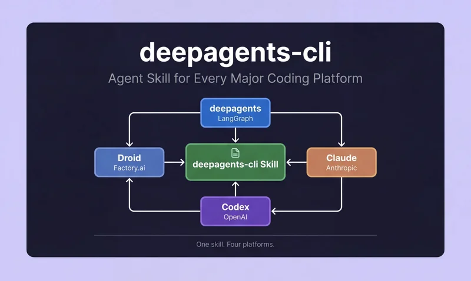

 

# deepagents CLI -- Agent Skill

**One skill. Four platforms.** The complete deepagents CLI reference and usage guide, packaged as an Agent Skill for every major coding agent.

---

## Overview

The deepagents CLI skill gives your coding agent comprehensive knowledge of the [deepagents](https://github.com/langchain-ai/deepagents) terminal assistant -- including session configuration, provider setup, memory management, skill authoring, sandbox execution, and workflow automation. Each variant below is the **same skill** adapted for a specific agent platform's filesystem conventions and invocation patterns.

### Why This Skill?

This isn't just a documentation reference. When your coding agent has this skill loaded, it can actively help you **work with deepagents** -- not just answer questions about it.

- **Learn by building.** Ask your agent to walk you through deepagents concepts, then have it set up a session, configure providers, or scaffold a skill -- all from within your current editor.
- **Author custom agents.** The skill includes the full SDK reference for `create_deep_agent()`, middleware, subagents, and backends. Your agent can help you design and implement specialized deepagents workflows tailored to your stack.
- **Extend deepagents itself.** Clone the [deepagents repo](https://github.com/langchain-ai/deepagents), install this skill, and let your coding agent help you customize the framework -- adding tools, modifying behavior, or building production pipelines.

The skill covers everything from first launch to programmatic customization, so your agent grows with you.

### Quick Reference

| Platform | Install | npm |
|:---------|:--------|:----|
| **deepagents** | `npx deepagents-cli-deepagents-skill init` |  |
| **Claude** | `npx deepagents-cli-claude-skill init` |  |
| **Codex** | `npx deepagents-cli-codex-skill init` |  |
| **Droid** | `npx deepagents-cli-droid-skill init` |  |

---

## Skill Variants

<!-- ============================================================ -->
<!-- deepagents -->
<!-- ============================================================ -->

<table>
<tr><td>

###  &nbsp; 

For the LangGraph [deepagents](https://github.com/langchain-ai/deepagents) framework. Supports named agent instances via the `--agent` flag and auto-discovery through `deepagents skills list`.

| | |
|:--|:--|
| **Install** | `npx deepagents-cli-deepagents-skill init` |
| **Personal path** | `~/.deepagents/<agent>/skills/deepagents-cli/` |
| **Workspace path** | `.deepagents/skills/deepagents-cli/` |
| **Invoke** | Auto-discovered -- verify with `deepagents skills list` |
| **Named agent** | `npx deepagents-cli-deepagents-skill init --agent my-agent` |
| **GitHub** | [Gitmaxd/deepagents-cli-deepagents-skill](https://github.com/Gitmaxd/deepagents-cli-deepagents-skill) |

</td></tr>
</table>

<!-- ============================================================ -->
<!-- Claude -->
<!-- ============================================================ -->

<table>
<tr><td>

###  &nbsp; 

For Claude Code, Claude Desktop, and claude.ai. Install via CLI or download the zip directly for Claude Desktop upload.

| | |
|:--|:--|
| **Install** | `npx deepagents-cli-claude-skill init` |
| **Personal path** | `~/.claude/skills/deepagents-cli/` |
| **Workspace path** | `.claude/skills/deepagents-cli/` |
| **Invoke** | `/deepagents-cli` |
| **GitHub** | [Gitmaxd/deepagents-cli-claude-skill](https://github.com/Gitmaxd/deepagents-cli-claude-skill) |

 

</td></tr>
</table>

<!-- ============================================================ -->
<!-- Codex -->
<!-- ============================================================ -->

<table>
<tr><td>

###  &nbsp; 

For OpenAI Codex. Filesystem-based skill loading with support for the `$skill-installer` convention.

| | |
|:--|:--|
| **Install** | `npx deepagents-cli-codex-skill init` |
| **Personal path** | `~/.agents/skills/deepagents-cli/` |
| **Workspace path** | `.agents/skills/deepagents-cli/` |
| **Invoke** | `$deepagents-cli` |
| **Alternative** | `$skill-installer deepagents-cli-codex-skill` |
| **GitHub** | [Gitmaxd/deepagents-cli-codex-skill](https://github.com/Gitmaxd/deepagents-cli-codex-skill) |

</td></tr>
</table>

<!-- ============================================================ -->
<!-- Droid -->
<!-- ============================================================ -->

<table>
<tr><td>

###  &nbsp; 

For Factory.ai Droid. This is the original, authoritative version of the skill.

| | |
|:--|:--|
| **Install** | `npx deepagents-cli-droid-skill init` |
| **Personal path** | `~/.factory/skills/deepagents-cli/` |
| **Workspace path** | `.factory/skills/deepagents-cli/` |
| **Invoke** | `/deepagents-cli` |
| **GitHub** | [Gitmaxd/deepagents-cli-droid-skill](https://github.com/Gitmaxd/deepagents-cli-droid-skill) |

</td></tr>
</table>

---

## What's Included

Every variant ships with the same comprehensive reference set:

| Document | Coverage |
|:---------|:---------|
| CLI Reference | Commands, flags, configuration options |
| Providers | LLM provider setup -- OpenAI, Anthropic, Google, AWS Bedrock, local models |
| Skills System | Authoring, installing, and managing agent skills |
| Memory and Persistence | Conversation memory, AGENTS.md context files, state management |
| Sandboxes | Docker and cloud sandbox configuration for safe code execution |
| SDK Customization | Python SDK for building custom agents, tools, and integrations |
| Streaming | Real-time token streaming, event hooks, output handling |
| Agent Communication Protocol | Inter-agent messaging and coordination via ACP |
| Workflows | Multi-step automation, CI/CD patterns, scripted agent pipelines |

---

## Links

- [Agent Skills Specification](https://agentskills.io) -- The open standard these skills follow
- [deepagents CLI Documentation](https://docs.langchain.com/deepagents) -- Official deepagents docs
- [deepagents GitHub](https://github.com/langchain-ai/deepagents) -- Source repository

## License

[MIT](LICENSE)
